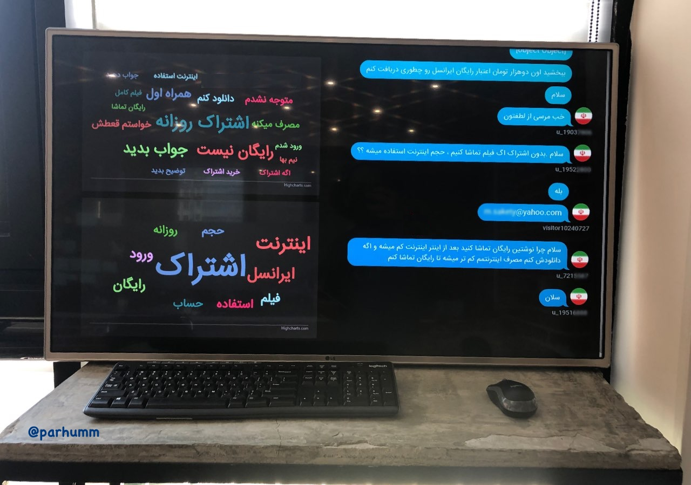

# Support UX Chat Cloud



-----

## Add App Authentication
Open ```auth.js``` and add your custom username and password to ```appAuth``` object.

-----

## Add Crisp Authentication

### Step 1
#### Obtain a Crisp API token
**Before you can connect to the Crisp API, you need to generate an API token.** An API token authenticates the user on Crisp systems, and is linked to a Crisp account. To access your Crisp website, this Crisp account must be an operator member of your website.

**As a Crisp account can hold a maximum of 20 tokens at the same time**, and knowing those tokens are also being generated by Crisp apps to login to your account (eg. Crisp iOS app, Crisp Web app), **we advise you create a Crisp operator account dedicated to pure-API & bot usage**. This way you ensure your API token is never expired due to token limit overflow (for instance, you may create a Crisp account on crisp-api@yourdomain.com).

To obtain a Crisp API token, open a terminal (on macOS, open the "Terminal" application). Then, enter the command:

```
curl -H "Content-Type: application/json" -X POST -d '{"email":"YOUR_ACCOUNT_EMAIL","password":"YOUR_ACCOUNT_PASSWORD"}' https://api.crisp.chat/v1/user/session/login
```
**Replace:**
- **YOUR_ACCOUNT_EMAIL:** Crisp account email
- **YOUR_ACCOUNT_PASSWORD:** Crisp account password

Then, press the Enter key, and wait for a response to your command. **A successful login response will contain a JSON payload, with an identifier and key value**, which you should copy and provide to your library calls. **This identifier + key pair is your authentication token; you should only keep a single one** for all your uses of Crisp APIs via a library we provide.

**Document Source:** [Developing Custom Chatbots for Crisp](https://crisp.chat/blog/developing-custom-chatbots-for-crisp/)


### Step 2
Open ```auth.js``` and add your Crisp ```identifier```, ```key``` and ```websiteId``` to ```crispAuth``` object.

-----

## Run Project
1. ```npm install```
2. ```npm start```
3. open http://localhost:3000
4. Send first message on Crisp Chat and test it

-----
## Contact Me
Feel free to ask your questions [@parhumm](https://twitter.com/parhumm) 